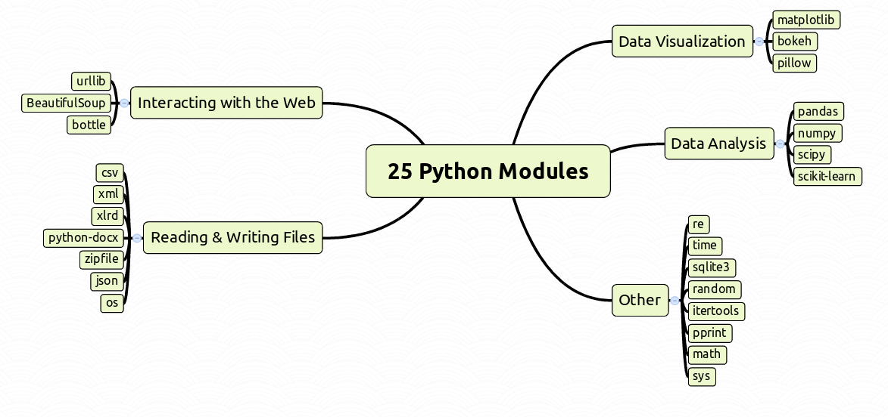

# Python 3 Module Examples

(c) 2016 Dr. Kristian Rother (krother@academis.eu)

Distributed under the conditions of the Creative Commons Attribution Share-alike License 4.0

Sources of this document can be found on [https://github.com/krother/Python3_Module_Examples](https://github.com/krother/Python3_Module_Examples) 

## Purpose of this e-book

This e-book contains my favourite Python modules. Every module comes with a *brief description* and a *code example*.

This document is for you if:

* you know a little bit of Python already
* you would like to know what Python modules are there
* you find the amount of Python modules overwhelming
* you find the full documentation too heavy to begin
* you would like to try a few simple examples

**Have fun getting to know Python better!**

## Overview

