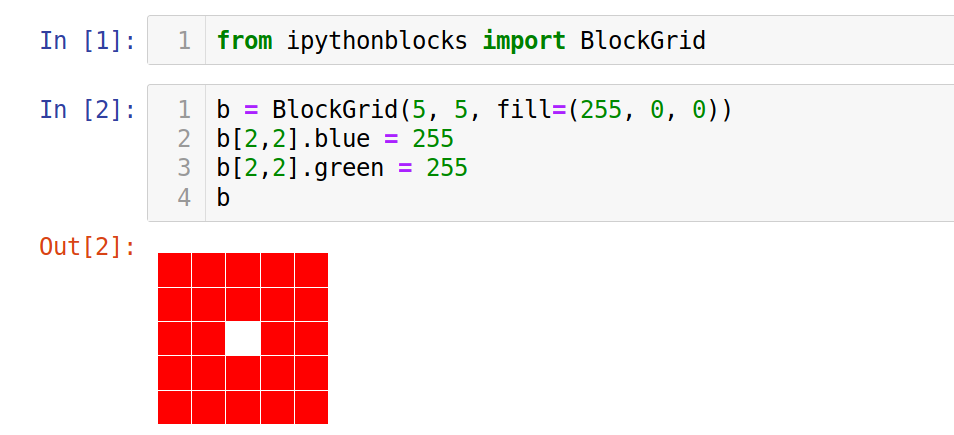

# IPythonblocks

### What it is good for?

Display block grids in Jupyter.

### Installed with Python or Anaconda

no

### How to install it?

    :::text
    pip install ipythonblocks

### Example

