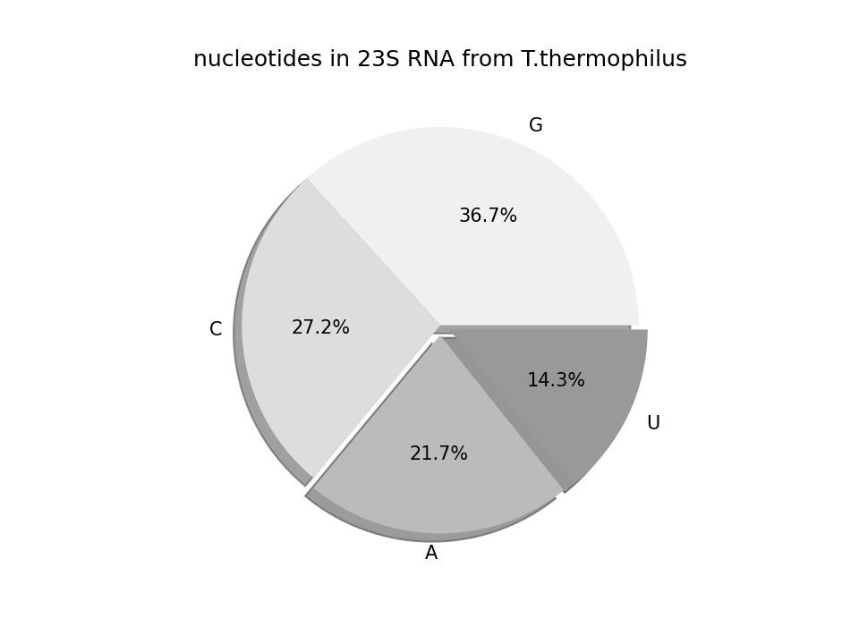

# matplotlib

### What it is good for?

Plotting diagrams.

`matplotlib` is capable of producing static images of all common types of diagrams in print quality: line plots, scatter plots, bar charts, pie charts, histograms, heat maps etc.

### Installed with Anaconda

yes

### How to install it:

    :::text
    pip install matplotlib

### Where to learn more?

A good way to learn what you can do is to browse the examples gallery on [matplotlib.org/](http://matplotlib.org/)

You find a comprehensive tutorial on [https://scipy-lectures.org/intro/matplotlib/index.html](https://scipy-lectures.org/intro/matplotlib/index.html)

### Scatterplot

:::include balls.py

### Bar Plot

:::include barplot.py

### Line Plot

:::include lineplot.py

### Error Bars

:::include errorbars.py

### Pie Chart

:::include piechart.py
