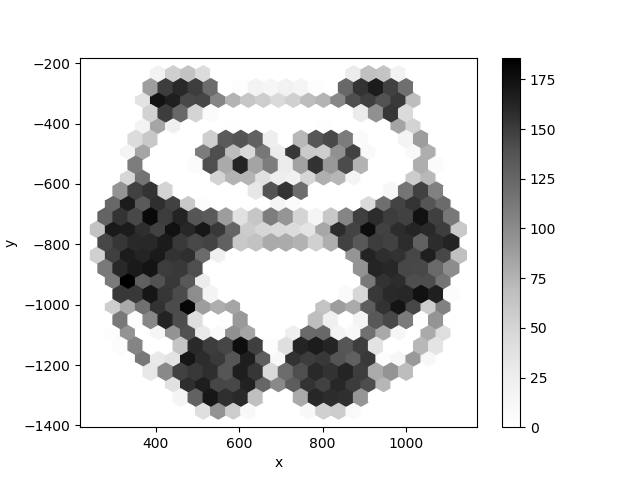

# pandas

### What it is good for?

Analyze tabular data.

`pandas` is an extremely powerful library to analyze, combine and manipulate data in many thinkable (and some unthinkable) ways. The tables called *DataFrame* have many similarities to R. DataFrames have an index column and functions for plotting and reading from CSV or Excel files are included by default. Pandas uses `numpy` under the hood.

### Installed with Python by default

no

### Installed with Anaconda

yes

### How to install it?

    pip install pandas

### Where to learn more?

[http://pandas.pydata.org/](http://pandas.pydata.org/)

## Example

Some eye candy created with pandas:

