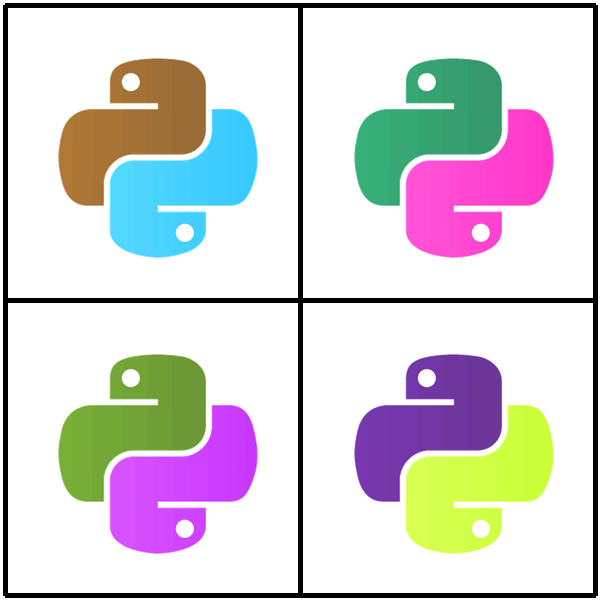

# Pillow

### What it is good for?

`Pillow` reads, writes and edits images.

It contains simple drawing tools and filters that can be applied to pixel based images.
The most important feature of `Pillow` is that it can read and write almost all popular image formats.

### Installed with Python by default

no

### Installed with Anaconda

yes

### How to install it?

    :::text
    pip install pillow

### Where to learn more?

[https://pillow.readthedocs.org](https://pillow.readthedocs.org)

### Shrink images

:::include half_size.py

### Create a dice image

:::include dice.py

### Mix color channels

:::include warhol.py

### Create turtle graphics

:::include snowflake.py

