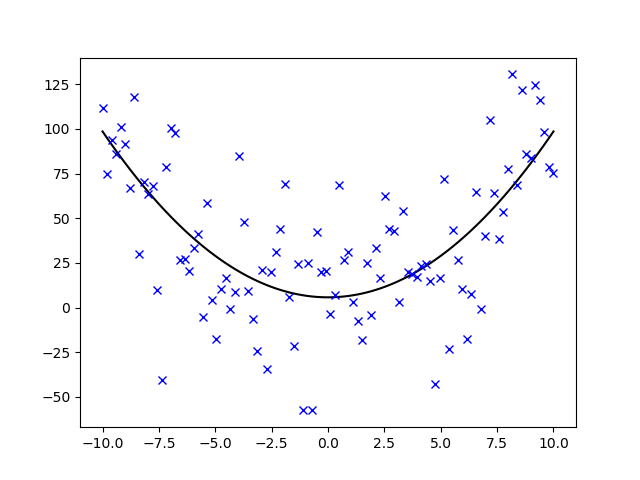

# Scipy

### What it is good for?

Scipy is a Python library for **numerical analyses** like fitting functions, signal processing, Fourier Transform, generating random datasets and many more. Scipy uses `numpy` and `matplotlib`.

### Installed with Python by default

no

### Installed with Anaconda

yes

### How to install it?

    pip install scipy

### Where to learn more?

[http://scipy.org/](http://scipy.org/)

## Example: fitting a curve

