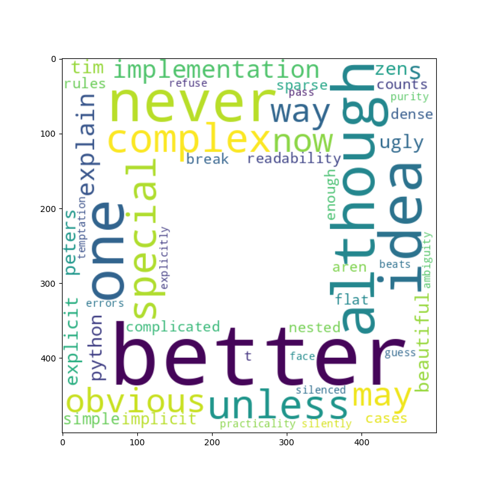

# wordcloud

### What it does

`wordcloud` draws word clouds from a string of words.

It allows to create clouds in arbitrary shapes.

### Installed with Python or Anaconda

no

### How to install it

    :::text
    pip install wordcloud

